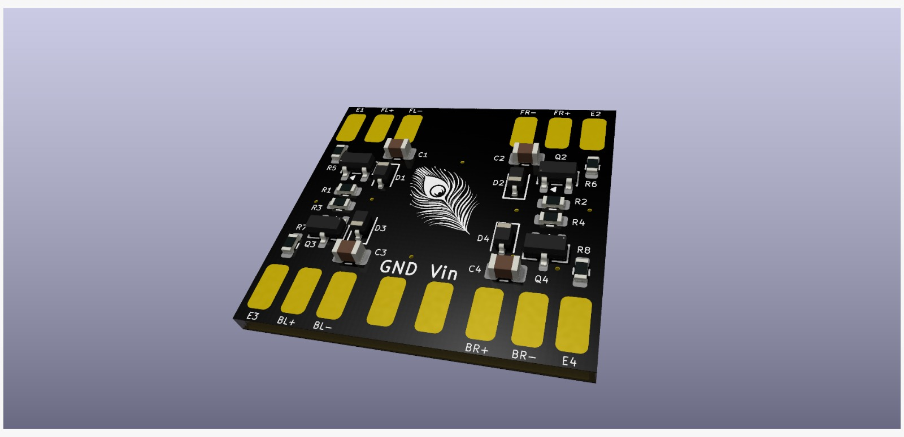

# 4-in-1 Brushed DC Motor ESC

A quad-channel electronic speed controller (ESC) designed for driving four brushed DC motors simultaneously. Built with discrete components including MOSFETs, capacitors, resistors, and diodes for efficient motor commutation and speed control. Perfect for drone builds, robotics, and multi-rotor applications.

## PCB Design

## Features

- **4 Independent Motor Channels** - Control 4 brushed DC motors independently
- **MOSFET-Based Drivers** - Efficient switching for smooth motor control
- **RC Filtering** - Smooth PWM signal conditioning
- **Flyback Diode Protection** - Protects against back-EMF spikes
- **Discrete Component Design** - Simple, reliable circuit using basic components
- **Compact Layout** - Optimized for drone integration

## Components Used

- **MOSFETs** - For motor switching and speed control
- **Capacitors** - Power filtering and signal conditioning
- **Resistors** - Gate pull-down for MOSFET control
- **Diodes** - Back-EMF protection and voltage regulation
- **PCB** - Custom designed for optimal layout

## Specifications

- **Motor Type** - Brushed DC motors
- **Number of Channels** - 4 independent channels
- **Control Signal** - PWM input (3.3V or 5V logic compatible)
- **Design** - Discrete component-based

## Files

- `ESC_4in1.kicad_sch` - Schematic design
- `ESC_4in1.kicad_pcb` - PCB layout
- `ESC_4in1.kicad_pro` - Project file

## Requirements

- KiCad 6.0 or later
- Basic understanding of motor control and PWM

## Applications

- Quadcopter builds
- Drone projects
- Robot motor control
- Multi-rotor vehicles
- DIY robotics

## License

MIT